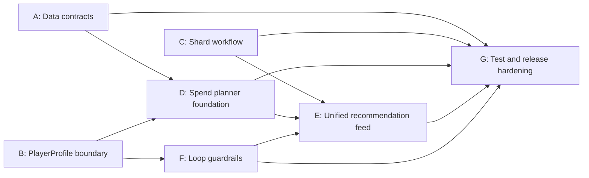

# Research Follow-up Execution Plan

## Purpose

Turn the findings in `reevaluation_research.md` into a repo-local execution plan that fits the current `main` branch, the MVP scope in `AGENTS.md`, and a parallel workflow where multiple contributors or agents can work at the same time without stepping on each other.

---

## Current state on clean `main`

The attached research correctly identified an earlier `app.js` correctness issue, but that issue should be treated as **historical context**, not the next blocker:

- `app.js` now imports `createDefaultPlayerProfile` and `normalizePlayerProfile` without redeclaring them
- `app.js` uses `CANONICAL_PROFILE_FIELD_PATHS`
- `tests/smoke.mjs` already runs `node --check` against `app.js`

That means the immediate path forward is no longer "unbreak the app." The immediate path forward is to harden the MVP boundaries, formalize data contracts, and land the spend/recommendation work in controlled slices.

---

## Rules for this plan

1. Stay inside MVP.
2. Keep `state.playerProfile` as the single source of truth.
3. Do not introduce invented formulas or fake precision.
4. Keep community-tool and extracted-model data clearly labeled.
5. Prefer shippable slices over broad refactors.

In practice, this means:

- shard work remains descriptive and grounded until verified numeric modeling exists
- token and multiverse data can inform planner structure, but not pretend to be complete optimizer truth
- non-MVP surfaces such as OCR, gem nodes, and research UI stay deprioritized unless required as supporting cleanup
- canonical systems with provisional external-model implementations should be labeled as such, not collapsed into speculative support-surface status

### Source priority rule

Current and future grounded data work should start by processing the committed APK and Unity extraction artifacts already available in this repo.

Use source priority in this order:

1. APK/Unity package artifacts and the repo's extraction outputs
2. official/public game-facing sources for naming, labeling, and cross-checking
3. community sources only to fill documented gaps or support clearly labeled external-model behavior

If a future feature enters Research Intake, the first question should be whether the available APK/Unity packages can ground it. If that path has not been checked and documented, the feature is not ready to leave research status.

---

## Recommended sequencing

### Stage 0: Lock the boundary

Before adding new planning logic, make the repo explicit about:

- what is canonical player state
- what is planning input
- what is external/community-tool state
- what is bundled dataset truth

### Stage 1: Make bundled data trustworthy

Add schema and validation around the shipped datasets so future planner work has a stable input contract.

This stage assumes the preferred raw input path is the checked-in APK/Unity package set, processed through the repo's parser and normalization scripts before anything is promoted into shipped JSON.

### Stage 2: Land MVP planner slices

Build shard workflow improvements, then token/diamond spend planning, then loop guardrails, then unify their outputs into the recommendation feed.

### Stage 3: Harden delivery

Add better tests, lightweight CI, and doc updates so future data drops do not silently regress the app.

---

## Parallel workstreams

These workstreams are designed to be assigned independently. Each one has a narrow write area and clear exit criteria.

### Workstream A: Data contract foundation

**Goal**

Define the contract for shipped datasets and make validation part of the local workflow.

**Primary files**

- `data/*.json`
- `scripts/`
- `tests/`
- `docs/`

**Tasks**

- define a shared dataset metadata envelope for shipped JSON assets
- document which datasets are canonical, grounded-descriptive, extracted, or community-derived
- add validation coverage for snapshot, shard, token-shop, and multiverse-market datasets
- add a single local command for dataset verification

**Deliverables**

- documented dataset contract
- validation script or test coverage for shipped datasets
- updated contributor guidance for adding or refreshing data assets

**Dependencies**

- none

**Can run in parallel with**

- Workstream B
- Workstream C

---

### Workstream B: PlayerProfile and import boundary cleanup

**Goal**

Tighten the boundary between canonical player state, planning helpers, and external models so downstream planner modules consume the right source.

**Primary files**

- `player-profile.js`
- `app.js`
- `docs/player-profile-schema.md`
- `docs/import-mapping.md`
- `tests/smoke.mjs`

**Tasks**

- audit current `PlayerProfile` fields against MVP-only game concepts
- remove or relabel any remaining ambiguous fields that blur truth vs derived/external state
- document import expectations for manual/guided player entry
- ensure new planner work reads from `state.playerProfile` first and only falls back to labeled external/community state when necessary

**Deliverables**

- clarified schema boundary
- doc updates for import and profile rules
- tests for normalization and legacy migration edge cases
- overview, validation, and support-surface copy that keeps external/community-tool outputs visibly outside grounded MVP truth
- page structure that keeps external-model calibration attached to its module implementation instead of the shared Profile surface
- module access patterns that read canonical, planner-only, external-model, and compatibility state through labeled accessors instead of ad hoc nested field reads

**Dependencies**

- none

**Can run in parallel with**

- Workstream A
- Workstream C

---

### Workstream C: Shard workflow hardening

**Goal**

Keep shards as a grounded MVP feature without drifting back into invented optimizer math.

**Primary files**

- `app.js`
- `data/shard-milestones.grounded.v1.json`
- `data/shard-observed-behaviors.grounded.v1.json`
- `data/shard-milestones-provenance.grounded.v1.json`
- `docs/shard-milestones-grounding-ingest.md`
- `tests/smoke.mjs`

**Tasks**

- review the shard workflow UI and recommendation output against the grounded datasets
- improve explainability, uncertainty labels, and manual workflow guidance
- keep disabled functionality clearly disabled where numeric truth is still missing
- ensure shard recommendations emit the standard recommendation action shape

**Deliverables**

- grounded shard recommendations that are explicit about assumptions
- updated shard workflow documentation
- tests for shard recommendation contract shape and guardrails
- shard and loop module outputs normalized through the shared recommendation action contract before they reach rendering
- shard and loop wording that points back to grounded source titles and provenance conflicts instead of generic caution text

**Dependencies**

- light coordination with Workstream B on `PlayerProfile` field usage

**Can run in parallel with**

- Workstream A
- Workstream B

---

### Workstream D: Token and diamond spend planner foundation

**Goal**

Use the extracted token-shop and multiverse-market data to build the MVP spend-planner foundation without overselling completeness.

**Primary files**

- `data/token-shop-values.json`
- `data/multiverse-market-values.json`
- `docs/token-shop-values.md`
- `docs/multiverse-market-values.md`
- `app.js`
- `tests/`

**Tasks**

- normalize the extracted spend datasets into a planner-friendly shape
- define what the MVP spend planner is allowed to recommend today
- separate verified cost/value facts from heuristics and user preference inputs
- add a first pass of token and diamond planning UI/recommendation logic

**Deliverables**

- documented spend-planner data model
- initial spend recommendations with explicit confidence and assumptions
- tests covering planner input parsing and output contract shape
- normalized token-shop and multiverse-market first-buy structures that keep extracted facts separate from owned-level assumptions
- a first spend-planner UI slice that uses tracked tokens and diamonds as labeled budget inputs while leaving provisional market-currency mapping explicit

**Dependencies**

- Workstream A should land first for dataset contract clarity
- Workstream B should define the canonical budget/resource fields first

**Can run in parallel with**

- Workstream E after interface contract is agreed

---

### Workstream E: Unified recommendation feed

**Goal**

Make shard, spend, and loop-warning outputs converge into one explainable recommendation feed.

**Primary files**

- `app.js`
- `index.html`
- `styles.css`
- `tests/smoke.mjs`
- relevant docs in `docs/`

**Tasks**

- enforce the shared recommendation action shape across modules
- normalize module scoring/confidence semantics enough for feed ranking
- improve rendering for `whyNow`, `assumptions`, and `warnings`
- make it obvious which recommendations are upgrades versus warnings

**Deliverables**

- one visible recommendation feed contract
- module output adapters where needed
- regression coverage for mixed-module feed rendering

**Dependencies**

- Workstream C for shard output
- Workstream D for spend output
- loop warning source work must exist before final integration

**Can run in parallel with**

- partial UI work can begin early, but final integration depends on upstream modules

---

### Workstream F: Loop-reset guardrails

**Goal**

Add warning-oriented loop guidance as an MVP trust layer, not as a speculative optimizer.

**Primary files**

- `app.js`
- `player-profile.js`
- `tests/`
- `docs/`

**Tasks**

- define the minimum grounded/player-entered inputs needed for loop warnings
- add warning rules for obviously bad reset timing or missing prerequisites
- keep outputs in `kind: "warning"` form with explainable reasons
- avoid fake ROI or reset simulation

**Deliverables**

- MVP loop warning module
- rule documentation
- tests for warning generation and message clarity

**Dependencies**

- Workstream B for profile/input boundary

**Can run in parallel with**

- Workstream D

---

### Workstream G: Test and release hardening

**Goal**

Make sure future changes fail fast when the app or dataset contracts drift.

**Primary files**

- `tests/smoke.mjs`
- `package.json`
- `.github/workflows/` if CI is introduced
- `docs/`

**Tasks**

- expand smoke coverage from string checks toward contract checks
- validate critical dataset shape and recommendation output shape
- keep `node --check` and add lightweight execution-path checks where practical
- add CI only after the local command set is stable

**Deliverables**

- stronger local test path
- optional CI workflow for `npm test`
- documented release checklist for updating datasets

**Dependencies**

- should track behind A, C, D, E, and F as their contracts stabilize

---

## Dependency map

---

## Suggested chunking for multiple contributors

Use these as the first parallel branches or agent assignments.

### Chunk 1: Contracts and docs

- own Workstream A
- optionally include the doc-only part of Workstream B
- avoid heavy `app.js` edits

### Chunk 2: Profile boundary

- own `player-profile.js`, import mapping, and profile tests
- coordinate with shard/spend owners on field names, not implementation details

### Chunk 3: Shards

- own shard recommendation behavior and shard docs
- do not expand into token or loop planning

### Chunk 4: Spend planner

- own token-shop and multiverse-market normalization plus spend recommendation logic
- do not rewrite shard or profile code beyond required integration points

### Chunk 5: Loop warnings

- own warning rules and warning rendering inputs
- keep scope limited to guardrails, not reset optimization

### Chunk 6: Feed integration and test hardening

- start after module contracts are visible
- own cross-module rendering and regression coverage

---

## Definition of done for the next milestone

The next milestone is complete when all of the following are true:

- shipped datasets have a documented contract and validation path
- `PlayerProfile` is the unambiguous source of canonical player state
- shard workflow remains grounded and explainable
- token/diamond spend planning exists in MVP-safe form
- loop-reset guardrails emit warnings without speculative simulation
- recommendations from active MVP modules converge into one feed
- tests cover syntax, profile normalization, dataset validity, and recommendation contract shape

---

## Recommended order for the first three PRs

### PR 1: Contracts and profile boundary

Bundle:

- Workstream A
- Workstream B
- any test scaffolding needed to enforce those contracts

Why first:

- it reduces ambiguity before feature work starts
- it gives every later PR a stable data and profile boundary

### PR 2: Shards and loop warnings

Bundle:

- Workstream C
- Workstream F

Why second:

- both are MVP-safe guidance features
- both can ship value without pretending to solve spend optimization yet

### PR 3: Spend planner and unified feed

Bundle:

- Workstream D
- Workstream E
- Workstream G follow-through needed to protect the new contracts

Why third:

- spend planning depends on the earlier contract work
- unified-feed work is easier once at least two recommendation-producing modules exist

---

## Notes to preserve from the attached research

These findings should remain in team memory even though the `app.js` blocker is already fixed on `main`:

- extracted game data should now be treated as first-class input, not side material
- provenance and uncertainty need to stay visible in docs and planner outputs
- tests should continue moving away from superficial string checks toward executable contract checks
- any recommendation logic should prefer descriptive confidence over invented optimizer certainty
