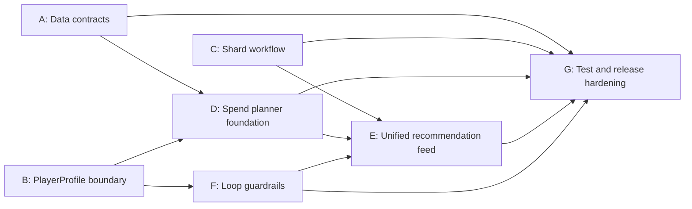

# Research Follow-up Execution Plan

## Purpose

Turn the repo-local research state into a staged implementation plan that fits `main`, the MVP scope in `AGENTS.md`, and shippable PR slices.

## Current state

The historical `app.js` blocker is already fixed on `main`. The next work is to harden boundaries and ship grounded MVP slices, not to "unbreak the app."

## Rules

1. Stay inside MVP.
2. Keep `state.playerProfile` as the single source of truth.
3. Do not introduce invented formulas or fake precision.
4. Keep extracted/community-tool data visibly labeled.
5. Prefer shippable slices over broad refactors.

Practical reading:

- shard work stays descriptive until numeric truth exists
- token and multiverse data can shape planner structure, not pretend to be complete optimizer truth
- non-MVP surfaces such as OCR, Gem Nodes, and research UI stay deprioritized unless needed as support cleanup
- canonical systems with provisional external-model implementations should stay labeled as such
- a system known to exist in CIFI is still blocked for planner work until owner, labels, currencies, and required player-state inputs are grounded

## Source priority rule

Start grounded data work from committed APK/Unity extraction artifacts already in the repo.

Priority:

1. APK/Unity artifacts and extraction outputs
2. official/public game-facing corroboration
3. community gap-filling or labeled external-model support

If the APK/Unity path has not been checked and documented, the feature should not leave research status.

## Sequence

0. Lock boundaries
   Clarify canonical player state, planning inputs, external-model state, and bundled dataset truth.
1. Make bundled data trustworthy
   Keep shipped datasets behind schema and validation.
2. Map systems before planner slices
   Confirm in-game placement, owner, currencies, inputs, and label mapping.
3. Land MVP planner slices
   Build only on systems that passed the mapping gate.
4. Harden delivery
   Expand tests and update docs so new data drops fail fast.

## Workstreams

### A. Data contracts

Goal:

- define the shipped dataset contract
- keep one checked-in manifest
- validate snapshot, shard, token-shop, and multiverse-market datasets
- keep the source-priority rule attached to that contract

Primary files:

- `data/*.json`
- `scripts/`
- `tests/`
- `docs/`

### B. PlayerProfile boundary

Goal:

- separate canonical player state, planner helpers, external models, and compatibility sinks
- ensure downstream code reads `state.playerProfile` first

Primary files:

- `player-profile.js`
- `app.js`
- `docs/player-profile-schema.md`
- `docs/import-mapping.md`
- `tests/smoke.mjs`

### C. Shard workflow hardening

Goal:

- keep shards in truthful descriptive mode until shipped-game owner mapping exists

Primary files:

- `app.js`
- shard grounded datasets
- shard docs
- `tests/smoke.mjs`

### D. Spend planner foundation

Goal:

- build spend planning only after TokenShop and MultiverseMarket pass the mapping gate

Primary files:

- spend datasets
- spend verification docs
- `app.js`
- `tests/`

### E. Unified recommendation feed

Goal:

- converge active MVP-safe outputs into one explainable recommendation feed

### F. Loop-reset guardrails

Goal:

- add warning-oriented loop guidance without speculative simulation

### G. Test and release hardening

Goal:

- make app and dataset contract drift fail fast

## Dependency map

## Milestone definition of done

The next milestone is complete when:

- shipped datasets have a documented contract and validation path
- `PlayerProfile` is the unambiguous source of canonical player state
- shard workflow stays grounded and explainable
- token/diamond spend planning exists in MVP-safe form
- loop guardrails emit warnings without speculative simulation
- active MVP modules converge into one feed
- tests cover syntax, profile normalization, dataset validity, and recommendation contract shape

## Recommended PR order

1. PR 1: data contracts + profile boundary
2. PR 2: shard workflow + loop warnings
3. PR 3: unified feed + follow-through hardening
4. PR 4: spend planner foundation

## Notes to preserve

- extracted game data should be treated as first-class input
- provenance and uncertainty should stay visible in docs and planner outputs
- tests should keep moving from superficial string checks toward executable contract checks
- recommendation logic should prefer descriptive confidence over invented optimizer certainty
